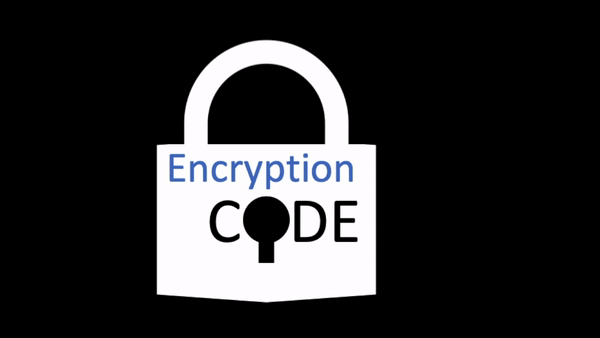
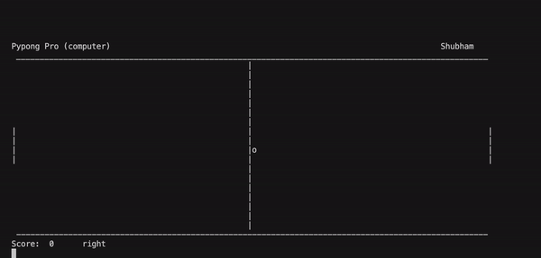
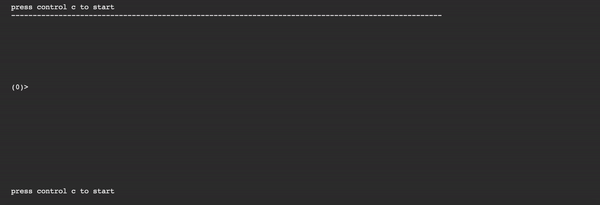
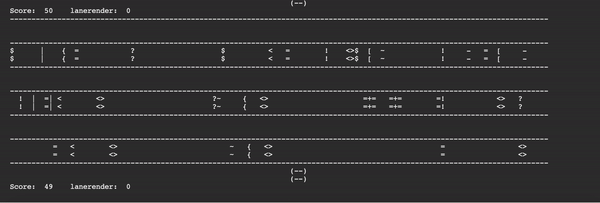
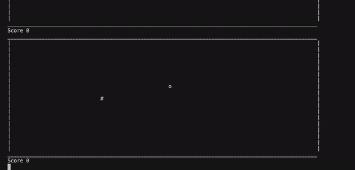
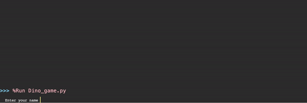
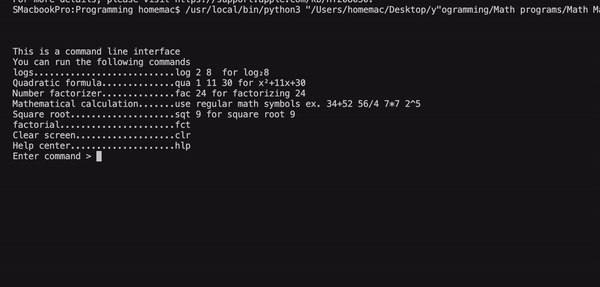
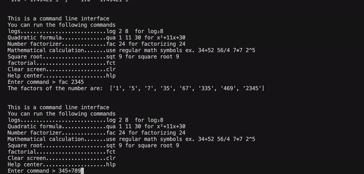

# Skparab1's Github Website

Anouncements:
- **Encryption code 2.2 has been released! View the release !(here)[https://github.com/Encryptioncode/Encryption-code/releases/tag/2.2] 

# Shubham's Software:

## Encryption code
 

- **Encryption code Website: sites.google.com/view/encryptioncode**
- **GitHub repository: github.com/skparab1/encryption-code**
- **GitHub organization: github.com/encryptioncode**
- **Encryption code video: https://www.youtube.com/watch?v=7Jy2Ln0EdFQ**
## Game codes
### Pong
 

**Github.com/skparab1/pong**

### Flappy bird

 

**Github.com/skparab1/flappy-bird**

### Crossy road

 

**Github.com/skparab1/crossy-road**

### Snake game

 

**Github.com/skparab1/pong**

### dino game

**Github.com/skparab1/dino-game**

## Math codes:
### Master math calculator
  

- **Github.com/skparab1/math-codes**
- **Github.com/skparab1/master-math-calculator**
- **github.com/Skparab1/math-codes/releases/tag/v0.1**
